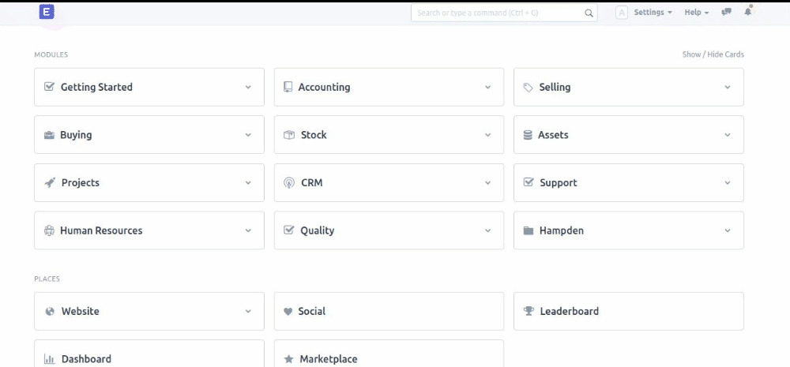
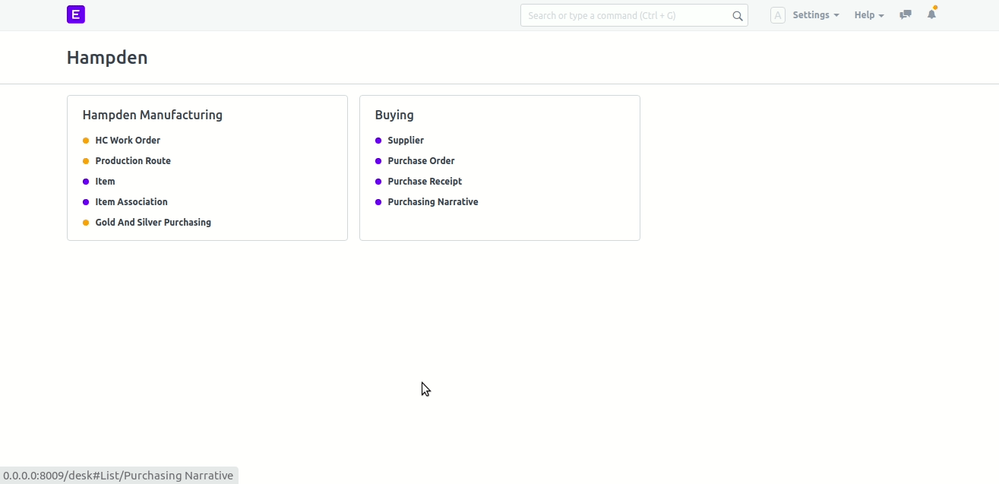
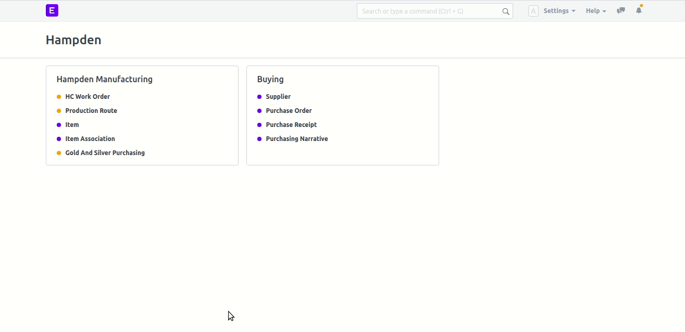
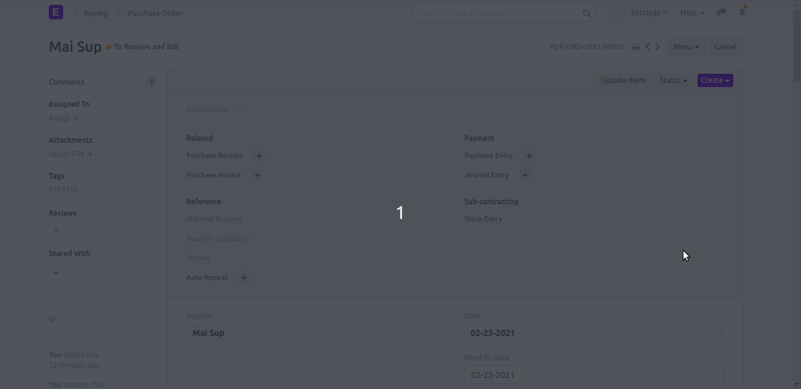

## Buying Process

<h3>To Buy a Metal, You must firstly go to Hampden module in desk page, as shown in the next GIF, then follow the steps as shown below: </h3>

<ul>
    <li>
        <h3><u>First step</u> Create Supplier Pricing Model:</h3>
        <ol>
            <li>Select Supplier Pricing Model from Hampden module.</li>
            <li>Click on the New button.</li>
            <li>Enter you data, then click save button.</li>
        </ol>
        <h6> This image will show you how to <b>Add New Supplier Pricing Model</b>  </h6>
        
    </li>
    <li>
        <h3><u>Second step</u> Update Supplier doctype,as follows</h3>
        <ol>
            <li>Go to Supplier doctype from Hampden module, then select the desired supplier doctype.</li>
            <li>scroll to Supplier Pricing Model Section, in Metal Costing Table specify the supplier Supplier Pricing Model.</li>
            <li>Save the doctype</li>
        </ol>
        <h6> This image will show you how to <b>Add Supplier Pricing Model to supplier</b></h6>
        
    </li>
    <li>
        <h3><u>Third step</u> Create Purshase Order</h3>
        <ol>
            <li>From Hampden module select Purshase Order</li>
            <li>Click on the New button.</li>
            <li>Add your Data as will show in the below GIF</li>
            <ul>
                <li>
                    <b>Metal Date</b> Metal price in this day
                </li>
                <li>
                    <b>Gold lock</b> Gold Price in Troy
                </li>
                <li>
                    <b>Silver lock</b> Silver Price in Troy
                </li>
                <li>
                    <b>GM 14k</b> The price of 14karat Gold in Gram 
                    Calculation will be like => <b>(gold_lock / 31.1035) * (14 / 24)</b>
                </li>
                <li>
                    <b>GM 10k</b> The price of Gold 10karat in Gram 
                    Calculation will be like => <b>(gold_lock / 31.1035) * (10 / 24)</b>
                </li>
                <li>
                    <b>SS(gm)</b> The price of Silver in Gram
                    Calculation will be like => <b>(silver_lock / 31.1035) * (.995)</b>
                </li>
                <li>
                    <b>Supplier Pricing Model</b> it's one of the supplier pricing models that was created before and specify to the current supplier 
                </li>
                <li>
                    <b>Item Code in Items table</b>When item code selected the Dependent item to this item will be added, and some calculations will be calculating as following:
                    <ol>
                        <li>
                            <b>Metal Price:</b> Will be the price in gram that calculated before, and it depends on the metal type that determines earlier in the selected supplier pricing model,
                              For Example : if the metal type determined in supplier pricing model was 14K , the <b>Metal Price</b> will equal the value of GM 14k Field
                        </li>
                        <li>
                            <b>Metal Value:</b> Will Calculate for the <b>Independent</b> Items, and equal to ( Metal Price Value * Qty )
                        </li>
                        <li>
                            <b>Total Cost:</b> For <b>Independent</b> Items, will equal to ( Metal Value )
                        </li>
                        <li>
                            <b>Metal Adder Value:</b> will Calculate just for <b>Dependent</b> Items, 
                            There are <b>2 Case</b> to calculate metal adder value:
                            <ul>
                                <li> IF metal adder type was determined in supplier pricing model <b>equal Plus%</b>  
                                    <b>metal adder value</b> = ( metal adder value which determined in supplier pricing model / 100) * Metal Value
                                </li>
                                <li> IF metal adder type was determined in supplier pricing model <b>equal Plus$ </b>  
                                    <b>metal adder value</b> = ( metal adder value which determined in supplier pricing model / 31.1035) * (14/24) or (10/24) or (0.995) it depentes on metal type determined in supplier pricing mode  * (qty)
                                     
                                    IF  metal type determined in supplier pricing model equal to 14K , we will multiply by (14/24)
                                     
                                    IF  metal type determined in supplier pricing model equal to 10K , we will multiply by (10/24) 
                                     
                                    IF  metal type determined in supplier pricing model equal to Silver , we will multiply by (0.995)
                                </li>
                            </ul>
                        </li>
                        <li>
                            <b>FAB Value:</b> will Calculate just for <b>Dependent</b> Items, 
                            There are <b>2 Case</b> to calculate FAB Value:
                            <ul>
                                <li> IF FAB Adder was determined in supplier pricing model <b>equal Plus%</b>  
                                    <b>FAB Value</b> = ( FAB Value which determined in supplier pricing model / 100) * (Metal Value + Metal Adder Value)
                                </li>
                                <li> IF FAB Adder was determined in supplier pricing model <b>equal Plus$ </b>  
                                    <b>FAB Value</b> = ( FAB Adder which determined in supplier pricing model / 31.1035) * (14/24) or (10/24) or (0.995) it depentes on metal type determined in supplier pricing mode  * (qty)
                                     
                                    IF metal type determined in supplier pricing model equal to 14K , we will multiply by (14/24)
                                     
                                    IF metal type determined in supplier pricing model equal to 10K , we will multiply by (10/24) 
                                     
                                    IF metal type determined in supplier pricing model equal to Silver , we will multiply by (0.995)
                                </li>
                            </ul>
                        </li>
                        <li>
                            <b>Total Cost:</b> For <b>Dependent</b> Items, will equal to ( Metal Adder Value + FAB Value )
                        </li>
                    </ol>
                </li>
            </ul>
            <li>Save the doctype then If you are sure from your data Submit the Purchase order </li>
        </ol>
        <h6> This image will show you how to <b>Create Purchase Order</b></h6>
        
    </li>
    <li>
        <h3><u>Last step</u> Create Purshase Reseipt</h3>
        <ol>
            <li>At the top of your purchase order doctype there is a <b>create button</b></li>
            <li>Click on the create button, and select <b>Reseipt</b></li>
            <li>Purshase Reseipt will open, same as your purchase order</li>
            <li>You can change some data if you want, like:</li>
            <ul>
                <li>
                    Metal Date
                </li>
                <li>
                    Gold lock
                </li>
                <li>
                    Silver lock
                </li>
                <li>
                    Qty of Item
                </li>
                <h5> <b>NOTE</b> If one of the previous value changed the All calculations Above Will be <b>recalculated</b> with the new value </h5>
            </ul>
            <li>Save and Submit the Receipt</li>
        </ol>
        <h6> This image will show you how to <b>Create Purchase Reseipt</b></h6>
        
    </li>
</ul>